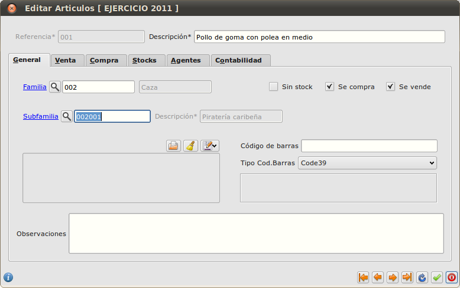

====================================================
Subfamilias: agrupación de familias en conjuntos
====================================================

Añade una nueva subcategoría dentro de cada familia de artículos: la subfamilia. Cada subfamilia pertenece a una sola familia, y cada artículo puede pertenecer a una única subfamilia.

---------------------
Pantallazos
---------------------

.. figure:: images/screen01.png

   Ficha de edición de artículos.
   Ruta imagen: images/screen01.png
   

   Ficha de edición de artículos.
   Ruta imagen: screen01.png
   

.. figure:: https://github.com/dezetage/eneboo-features/blob/master/ext0015-subfamilia/screen01.png

   Ficha de edición de artículos.
   Ruta imagen: https://github.com/dezetage/eneboo-features/blob/master/ext0015-subfamilia/screen01.png
   

.. figure:: /dezetage/eneboo-features/blob/master/ext0015-subfamilia/screen01.png?raw=true

   Ficha de edición de artículos.
   Ruta imagen: /dezetage/eneboo-features/blob/master/ext0015-subfamilia/screen01.png?raw=true

.. figure:: /dezetage/eneboo-features/blob/master/ext0015-subfamilia/screen01.png

   Ficha de edición de artículos.
   Ruta imagen: /dezetage/eneboo-features/blob/master/ext0015-subfamilia/screen01.png?raw=true

